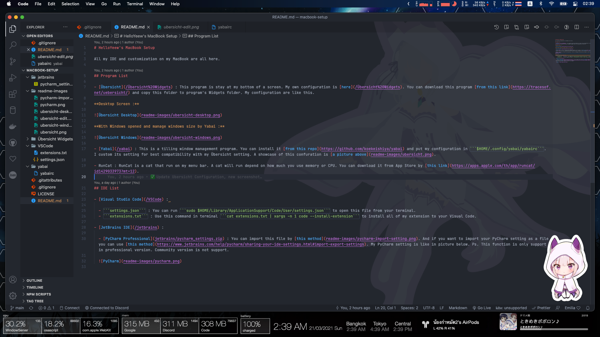

# HelloYeew's MacBook Setup

All my IDE and customization on my MacBook are all here.

## Program List

- [Übersicht](/Übersicht%20Widgets) : This program is stay at my bottom of a screen. My own configuration is [here](/Übersicht%20Widgets). You can download this program [from this link](https://tracesof.net/uebersicht/) and copy this folder to program's Widgets folder. My configuration are like this.

  **Desktop Screen :**

  

  **With Windows opened and manage windows size by Yabai :**

  

- [Yabai](/yabai) : This is a tilling window management program. You can install it [from this repo](https://github.com/koekeishiya/yabai) and put my configuration in ```$HOME/.config/yabai/yabairc```. I custom its setting for best compatibility with my Übersicht setting. A showcase of this confuration is [a picture above](readme-images/ubersicht.png).

- RunCat : RunCat is a cat that run on my menu bar. A cat will run depend on how much you use memory or CPU. You can download it from App Store by [this link](https://apps.apple.com/th/app/runcat/id1429033973?mt=12).

- Hidden Bar : I use this app because I have many icon on menu bar and I want my manu bar to be more 'clean'. You can download this app from [App Store](https://apps.apple.com/app/hidden-bar/id1452453066) or [GitHub Repositories](https://github.com/dwarvesf/hidden)

- iStat Menus : This app can tell about stats on your menu bar. You can change a custmization a lot. You can download it [here](https://apps.apple.com/th/app/istat-menus/id1319778037?mt=12). I don't have a configuration file (because it doesn't have) but you can see my configuration and customize it from a picture below. Ps. This app is not free. It's cost about 10 dollar but you can get a 14 days trail from [here](https://bjango.com/mac/istatmenus/).

  

## IDE List

- [Visual Studio Code](/VSCode) : 

  - ```settings.json``` : You can run ```sudo $HOME/Library/ApplicationSupport/Code/User/settings.json``` to open this file from your terminal.
  - ```extensions.txt``` : Use this command in terminal ```cat extensions.txt | xargs -n 1 code --install-extension``` to install all of my extension to your Visual Code.

- [JetBrains IDE](/jetbrains) :
  
  - [PyCharm Professional](jetbrains/pycharm_settings.zip) : You can import this file by [this method](readme-images/pycharm-import-setting.png). And if you want to import your PyCharm setting as a file you can use [this method](https://www.jetbrains.com/help/pycharm/sharing-your-ide-settings.html#import-export-settings). My PyCharm setting is like in picture below. Ps. This function is only support in professional version. Community version is not support.

    
